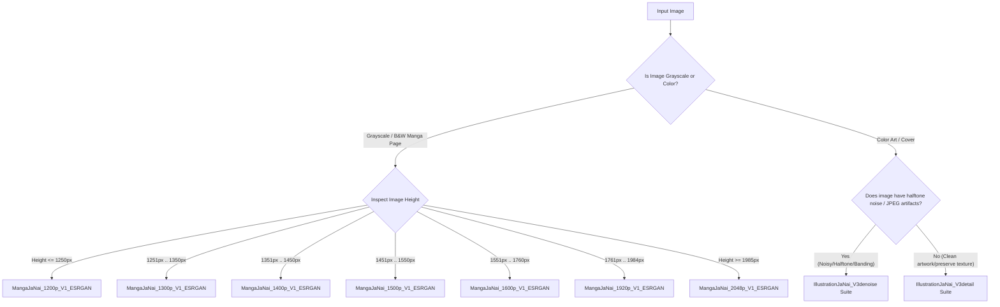

# MangaJaNai ONNX Models — Integration & Consumption Guide

> **Audience**: AI Agents, Backend Developers, and Pipeline Integrators  
> **Purpose**: Complete guide to consuming and running MangaJaNai & IllustrationJaNai ONNX models without needing to reverse engineer model architectures, tensor formats, preprocessing/postprocessing, or routing heuristics.

---

## 1. Quick Release Information

* **GitHub Release**: [`v3.0.0-onnx`](https://github.com/Lolle2000la/MangaJaNai/releases/tag/v3.0.0-onnx)
* **Repository**: `Lolle2000la/MangaJaNai`
* **Base Download URL**: `https://github.com/Lolle2000la/MangaJaNai/releases/download/v3.0.0-onnx/`
* **Opset Version**: ONNX Opset 17
* **Spatial Dimensions**: Fully Dynamic (`['batch_size', 3, 'height', 'width']`)
* **Default Precision**: `Float32` (universal CPU/GPU execution compatibility)

### Release Archives

| Archive Name | Size | Architecture(s) Included | Primary Use Case |
|---|---|---|---|
| `IllustrationJaNai_V1_ONNX.zip` | 115.8 MB | ESRGAN (RRDBNet), DAT2 | V1 Color Art (2x, 4x) |
| `4x_IllustrationJaNai_V2standard_ONNX.zip` | 150.0 MB | DAT2, FDAT (M, XL, unshuffle) | V2 Color Art (2x, 4x) |
| `MangaJaNai_V1_ONNX.zip` | 527.2 MB | ESRGAN (RRDBNet) | Core B&W Manga Page Suite (7 resolutions, 2x & 4x) |
| `IllustrationJaNai_V3denoise_ONNX.zip` | 150.6 MB | DAT2, FDAT (M, XL, unshuffle), SPAN | V3 Color Art with Halftone/JPEG Denoising |
| `IllustrationJaNai_V3detail_ONNX.zip` | 299.3 MB | HAT, DAT2, FDAT (M, XL, unshuffle), SPAN | V3 Color Art with Maximum Texture/Detail Retention |
| `sha256sums.txt` | 4.0 KB | All checksums | Checksum verification |

> [!NOTE]
> All `.zip` files contain the `.onnx` files directly at the archive root without nested subdirectories.

---

## 2. Tensor Contract & Image I/O

Every model in this suite conforms to a standardized ONNX tensor contract:

### Input Tensor
* **Name**: `"input"`
* **Shape**: `[batch_size, 3, height, width]` (Dynamic axes: batch size, height, width). Recommended inference batch size: `1`.
* **Data Type**: `float32` (or `float16` for SPAN fp16 if running on FP16 execution providers).
* **Color Order**: **RGB** (If using OpenCV `cv2.imread`, convert BGR to RGB first).
* **Value Range**: Normalized to `[0.0, 1.0]` via `x = image_array.astype(np.float32) / 255.0`.
  * **Do NOT** subtract ImageNet mean or divide by standard deviation.

### Output Tensor
* **Name**: `"output"`
* **Shape**: `[batch_size, 3, height * scale, width * scale]` (Scale is either `2` or `4`).
* **Data Type**: `float32` (matches input).
* **Value Range**: Output pixels are in `[0.0, 1.0]`.
* **Post-processing**:
  ```python
  output = np.clip(output * 255.0, 0.0, 255.0).round().astype(np.uint8)
  # Convert back to HWC
  output = np.transpose(output.squeeze(0), (1, 2, 0))  # [C, H, W] -> [H, W, C]
  # Convert RGB -> BGR if saving via cv2
  ```

---

## 3. Spatial Dimension Constraints & Padding Rules

Because the suite contains **Window-Attention Transformer** architectures (FDAT, DAT2, HAT) alongside convolution-based models (ESRGAN, SPAN), input dimensions must satisfy window alignment requirements:

| Architecture | Minimum Input Size | Required Dimension Multiple |
|---|---|---|
| **ESRGAN** (RRDBNet) | 1x1 | Multiple of `1` (Any arbitrary dimension) |
| **SPAN** | 1x1 | Multiple of `1` (Any arbitrary dimension) |
| **HAT** | 16x16 | Multiple of `16` |
| **DAT2** | 16x16 | Multiple of `16` (Due to shifted window splits) |
| **FDAT** (4x models) | 8x8 | Multiple of `8` |
| **FDAT** (2x unshuffle models) | 16x16 | Multiple of `16` (2x unshuffle / window size 8) |

### Golden Rule for Padding
To safely run **any** model across the entire inventory without branching logic:
1. Pad input image dimensions `(height, width)` to the nearest **multiple of 16** (or 32).
2. Use **reflect padding** on the bottom and right edges.
3. Perform model forward pass.
4. Crop the resulting output image to `[: orig_height * scale, : orig_width * scale]`.

```python
def pad_to_multiple(img: np.ndarray, multiple: int = 16):
    """
    img shape: (H, W, C)
    Pads bottom and right edges using reflect padding.
    """
    h, w = img.shape[:2]
    pad_h = (multiple - (h % multiple)) % multiple
    pad_w = (multiple - (w % multiple)) % multiple
    
    if pad_h > 0 or pad_w > 0:
        padded = np.pad(img, ((0, pad_h), (0, pad_w), (0, 0)), mode="reflect")
    else:
        padded = img
    return padded, pad_h, pad_w

def crop_padded_output(output: np.ndarray, orig_h: int, orig_w: int, scale: int):
    """
    output shape: (H_scaled, W_scaled, C)
    """
    return output[: orig_h * scale, : orig_w * scale, :]
```

---

## 4. Model Selection & Routing Logic

The MangaJaNai ecosystem uses specialized models tailored to image types and resolutions.



### 4.1. Core Manga Pages (B&W / Grayscale)
Manga releases in Japan have standardized digital resolutions with halftone frequencies optimized for specific display heights. Using the corresponding height model prevents moiré distortion and correctly reconstructs dot patterns:

| Input Height Range | Recommended Model (2x) | Recommended Model (4x) |
|---|---|---|
| **Height $\le$ 1250 px** | `2x_MangaJaNai_1200p_V1_ESRGAN_70k.onnx` | `4x_MangaJaNai_1200p_V1_ESRGAN_70k.onnx` |
| **1251 px – 1350 px** | `2x_MangaJaNai_1300p_V1_ESRGAN_75k.onnx` | `4x_MangaJaNai_1300p_V1_ESRGAN_75k.onnx` |
| **1351 px – 1450 px** | `2x_MangaJaNai_1400p_V1_ESRGAN_70k.onnx` | `4x_MangaJaNai_1400p_V1_ESRGAN_105k.onnx` |
| **1451 px – 1550 px** | `2x_MangaJaNai_1500p_V1_ESRGAN_90k.onnx` | `4x_MangaJaNai_1500p_V1_ESRGAN_105k.onnx` |
| **1551 px – 1760 px** | `2x_MangaJaNai_1600p_V1_ESRGAN_90k.onnx` | `4x_MangaJaNai_1600p_V1_ESRGAN_70k.onnx` |
| **1761 px – 1984 px** | `2x_MangaJaNai_1920p_V1_ESRGAN_70k.onnx` | `4x_MangaJaNai_1920p_V1_ESRGAN_105k.onnx` |
| **Height $\ge$ 1985 px** | `2x_MangaJaNai_2048p_V1_ESRGAN_95k.onnx` | `4x_MangaJaNai_2048p_V1_ESRGAN_70k.onnx` |

### 4.2. Color Art (IllustrationJaNai V3)
Choose between **V3detail** and **V3denoise**:
* **V3detail**: Does not remove halftone dots; maximizes sharpness, fine line art, and original texture. Ideal for clean digital drawings.
* **V3denoise**: Successor to V2standard; actively removes printed halftone noise, JPEG compression artifacts, and color gradient banding. Ideal for scanned manga covers.

#### Architecture Hierarchy (Quality vs. Speed)
Within either V3 bundle, select based on performance constraints:

| Architecture | Scale | Speed (Relative) | Quality Grade | Best Use |
|---|---|---|---|---|
| **4x HAT L** | 4x | Baseline (1.0x) | ⭐⭐⭐⭐⭐ Highest | Maximum quality detail reconstruction (Detail only) |
| **4x DAT2** | 4x | ~1.2x faster than HAT | ⭐⭐⭐⭐⭐ Highest | Best overall quality for Denoise; top-tier detail |
| **4x FDAT XL** | 4x | ~3.8x faster | ⭐⭐⭐⭐ High | Balanced quality/speed tradeoff |
| **4x FDAT M** | 4x | ~10x faster | ⭐⭐⭐ Good | High-throughput batch conversion |
| **2x FDAT M unshuffle**| 2x | ~60x faster | ⭐⭐⭐ Good | Standard 2x color upscaling |
| **2x SPAN S** | 2x | ~200x+ (Real-time) | ⭐⭐ Fast | Ultra-fast mobile/embedded or clean input 2x |

---

## 5. Execution Providers & Performance Tuning

Configure `onnxruntime.InferenceSession` with hardware acceleration providers in priority order:

```python
import onnxruntime as ort

def create_session(model_path: str) -> ort.InferenceSession:
    providers = [
        # 1. NVIDIA TensorRT / CUDA
        ("TensorrtExecutionProvider", {"device_id": 0}),
        ("CUDAExecutionProvider", {"device_id": 0, "cudnn_conv_algo_search": "DEFAULT"}),
        # 2. AMD ROCm / MIGraphX
        ("MIGraphXExecutionProvider", {}),
        ("ROCMExecutionProvider", {}),
        # 3. DirectML (Windows / Multi-vendor GPUs)
        ("DmlExecutionProvider", {"device_id": 0}),
        # 4. CPU Fallback
        ("CPUExecutionProvider", {}),
    ]
    
    sess_options = ort.SessionOptions()
    sess_options.graph_optimization_level = ort.GraphOptimizationLevel.ORT_ENABLE_ALL
    sess_options.enable_mem_pattern = True
    
    return ort.InferenceSession(model_path, sess_options=sess_options, providers=providers)
```

---

## 6. Complete Python Implementation (End-to-End Upscaler)

Here is a production-ready, self-contained Python script to load any model, handle reflect padding, tile large images seamlessly, and save the result:

```python
#!/usr/bin/env python3
"""
MangaJaNai ONNX Universal Inference Pipeline
"""

from pathlib import Path
from typing import Optional, Tuple
import cv2
import numpy as np
import onnxruntime as ort


class MangaJaNaiUpscaler:
    def __init__(self, model_path: str | Path):
        self.model_path = Path(model_path)
        if not self.model_path.exists():
            raise FileNotFoundError(f"Model not found: {self.model_path}")

        sess_options = ort.SessionOptions()
        sess_options.graph_optimization_level = ort.GraphOptimizationLevel.ORT_ENABLE_ALL

        # Try CUDA/DirectML first, fallback to CPU
        available = ort.get_available_providers()
        chosen_providers = [p for p in ["CUDAExecutionProvider", "DmlExecutionProvider", "CPUExecutionProvider"] if p in available]

        self.session = ort.InferenceSession(str(self.model_path), sess_options=sess_options, providers=chosen_providers)
        self.input_name = self.session.get_inputs()[0].name
        self.output_name = self.session.get_outputs()[0].name
        self.is_fp16 = "float16" in self.session.get_inputs()[0].type

        # Auto-detect scale from model filename (default 4x, or 2x if name starts with 2x)
        self.scale = 2 if self.model_path.stem.startswith("2x") else 4

    def upscale_image(
        self,
        image_bgr: np.ndarray,
        tile_size: Optional[int] = None,
        tile_pad: int = 16,
    ) -> np.ndarray:
        """
        Upscales an image (H, W, C) BGR uint8 format.
        If tile_size is provided (e.g., 512, 768), tiles the image to prevent OOM.
        """
        if tile_size is not None and (image_bgr.shape[0] > tile_size or image_bgr.shape[1] > tile_size):
            return self._upscale_tiled(image_bgr, tile_size=tile_size, tile_pad=tile_pad)
        else:
            return self._upscale_single(image_bgr)

    def _upscale_single(self, image_bgr: np.ndarray) -> np.ndarray:
        h, w = image_bgr.shape[:2]

        # 1. Convert BGR -> RGB & Normalize to [0, 1]
        img_rgb = cv2.cvtColor(image_bgr, cv2.COLOR_BGR2RGB).astype(np.float32) / 255.0

        # 2. Reflect pad to multiple of 16
        pad_h = (16 - (h % 16)) % 16
        pad_w = (16 - (w % 16)) % 16
        if pad_h > 0 or pad_w > 0:
            img_rgb = np.pad(img_rgb, ((0, pad_h), (0, pad_w), (0, 0)), mode="reflect")

        # 3. Shape [H, W, C] -> [1, C, H, W]
        tensor = np.transpose(img_rgb, (2, 0, 1))[np.newaxis, :]
        if self.is_fp16:
            tensor = tensor.astype(np.float16)

        # 4. Inference
        output = self.session.run([self.output_name], {self.input_name: tensor})[0]

        # 5. Shape [1, C, H, W] -> [H, W, C]
        output = np.transpose(output.squeeze(0), (1, 2, 0)).astype(np.float32)

        # 6. Crop padding
        output = output[: h * self.scale, : w * self.scale, :]

        # 7. Denormalize & RGB -> BGR
        output = np.clip(output * 255.0, 0.0, 255.0).round().astype(np.uint8)
        return cv2.cvtColor(output, cv2.COLOR_RGB2BGR)

    def _upscale_tiled(self, image_bgr: np.ndarray, tile_size: int = 512, tile_pad: int = 16) -> np.ndarray:
        h, w = image_bgr.shape[:2]
        out_h, out_w = h * self.scale, w * self.scale
        out_bgr = np.zeros((out_h, out_w, 3), dtype=np.uint8)

        # Step through tiles
        for y in range(0, h, tile_size):
            for x in range(0, w, tile_size):
                # Calculate tile input with padding
                y1 = max(y - tile_pad, 0)
                x1 = max(x - tile_pad, 0)
                y2 = min(y + tile_size + tile_pad, h)
                x2 = min(x + tile_size + tile_pad, w)

                tile = image_bgr[y1:y2, x1:x2]
                upscaled_tile = self._upscale_single(tile)

                # Calculate placement in destination
                out_y1 = y * self.scale
                out_x1 = x * self.scale
                out_y2 = min((y + tile_size) * self.scale, out_h)
                out_x2 = min((x + tile_size) * self.scale, out_w)

                # Calculate crop inside tile
                crop_y1 = (y - y1) * self.scale
                crop_x1 = (x - x1) * self.scale
                crop_y2 = crop_y1 + (out_y2 - out_y1)
                crop_x2 = crop_x1 + (out_x2 - out_x1)

                out_bgr[out_y1:out_y2, out_x1:out_x2] = upscaled_tile[crop_y1:crop_y2, crop_x1:crop_x2]

        return out_bgr


if __name__ == "__main__":
    # Example usage:
    upscaler = MangaJaNaiUpscaler("2x_IllustrationJaNai_V3detail_SPAN_S_40k_fp16.onnx")
    sample_img = cv2.imread("input.png")
    if sample_img is not None:
        result = upscaler.upscale_image(sample_img, tile_size=768)
        cv2.imwrite("output_upscaled.png", result)
        print("Upscale successful!")
```

---

## 7. Complete Model Inventory & File Mapping

Below is the complete file manifest available across all 5 release packages:

```
IllustrationJaNai_V1_ONNX.zip
├── 2x_IllustrationJaNai_V1_ESRGAN_120k.onnx         (ESRGAN, Scale: 2x)
├── 4x_IllustrationJaNai_V1_DAT2_190k.onnx           (DAT2,   Scale: 4x)
└── 4x_IllustrationJaNai_V1_ESRGAN_135k.onnx         (ESRGAN, Scale: 4x)

4x_IllustrationJaNai_V2standard_ONNX.zip
├── 2x_IllustrationJaNai_V2standard_FDAT_M_unshuffle_40k.onnx  (FDAT, Scale: 2x)
├── 4x_IllustrationJaNai_V2standard_DAT2_27k.onnx             (DAT2, Scale: 4x)
├── 4x_IllustrationJaNai_V2standard_FDAT_M_52k.onnx           (FDAT, Scale: 4x)
└── 4x_IllustrationJaNai_V2standard_FDAT_XL_18k.onnx          (FDAT, Scale: 4x)

MangaJaNai_V1_ONNX.zip
├── 2x_MangaJaNai_1200p_V1_ESRGAN_70k.onnx
├── 2x_MangaJaNai_1300p_V1_ESRGAN_75k.onnx
├── 2x_MangaJaNai_1400p_V1_ESRGAN_70k.onnx
├── 2x_MangaJaNai_1500p_V1_ESRGAN_90k.onnx
├── 2x_MangaJaNai_1600p_V1_ESRGAN_90k.onnx
├── 2x_MangaJaNai_1920p_V1_ESRGAN_70k.onnx
├── 2x_MangaJaNai_2048p_V1_ESRGAN_95k.onnx
├── 4x_MangaJaNai_1200p_V1_ESRGAN_70k.onnx
├── 4x_MangaJaNai_1300p_V1_ESRGAN_75k.onnx
├── 4x_MangaJaNai_1400p_V1_ESRGAN_105k.onnx
├── 4x_MangaJaNai_1500p_V1_ESRGAN_105k.onnx
├── 4x_MangaJaNai_1600p_V1_ESRGAN_70k.onnx
├── 4x_MangaJaNai_1920p_V1_ESRGAN_105k.onnx
└── 4x_MangaJaNai_2048p_V1_ESRGAN_70k.onnx

IllustrationJaNai_V3denoise_ONNX.zip
├── 2x_IllustrationJaNai_V3denoise_FDAT_M_unshuffle_30k_fp16.onnx  (FDAT, Scale: 2x)
├── 2x_IllustrationJaNai_V3denoise_SPAN_S_30k_fp16.onnx            (SPAN, Scale: 2x)
├── 4x_IllustrationJaNai_V3denoise_DAT2_27k_bf16.onnx              (DAT2, Scale: 4x)
├── 4x_IllustrationJaNai_V3denoise_FDAT_M_47k_fp16.onnx            (FDAT, Scale: 4x)
└── 4x_IllustrationJaNai_V3denoise_FDAT_XL_32k_bf16.onnx           (FDAT, Scale: 4x)

IllustrationJaNai_V3detail_ONNX.zip
├── 2x_IllustrationJaNai_V3detail_FDAT_M_unshuffle_40k_fp16.onnx   (FDAT, Scale: 2x)
├── 2x_IllustrationJaNai_V3detail_SPAN_S_40k_fp16.onnx             (SPAN, Scale: 2x)
├── 4x_IllustrationJaNai_V3detail_DAT2_28k_bf16.onnx               (DAT2, Scale: 4x)
├── 4x_IllustrationJaNai_V3detail_FDAT_M_40k_fp16.onnx             (FDAT, Scale: 4x)
├── 4x_IllustrationJaNai_V3detail_FDAT_XL_27k_bf16.onnx            (FDAT, Scale: 4x)
└── 4x_IllustrationJaNai_V3detail_HAT_L_28k_bf16.onnx              (HAT,  Scale: 4x)
```
